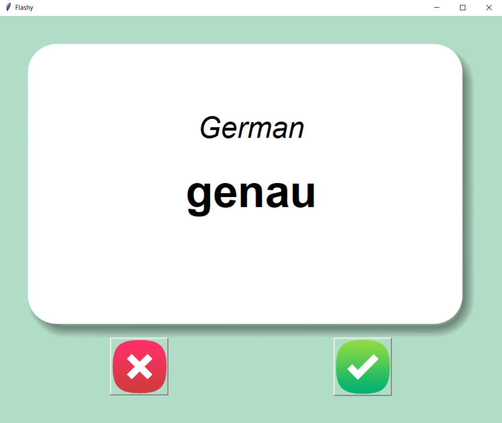
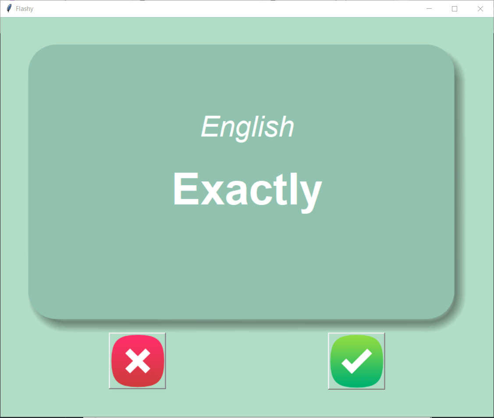

# Flash Card Language Learning App

A simple and interactive flash card application for memorizing German-English vocabulary.

## Features

- Displays a German word with an English translation after a short delay
- Click ✓ if you know the word - it will be removed from the future sessions
- Click ✗ to skip to the next word
- Saves progress in `words_to_learn.csv` file.
- Uses a pleasant GUI with images and timer-based flips

## How It Works

1. The app starts by loading the words from `data/words_to_learn.csv` if it exists, otherwise from
   `data/german_words.csv`.
2. A German word is shown on a flash card.
3. After 3 seconds, the card flips to reveal the English translation.
4. You can click:
    - **✓** if you know the word (it removes it from the list)
    - **✗** if you don’t (it keeps it in the list)
5. Your progress is saved automatically.

## Technologies Used

- Python 3.12.2
- Tkinter
- Pandas
- Random

